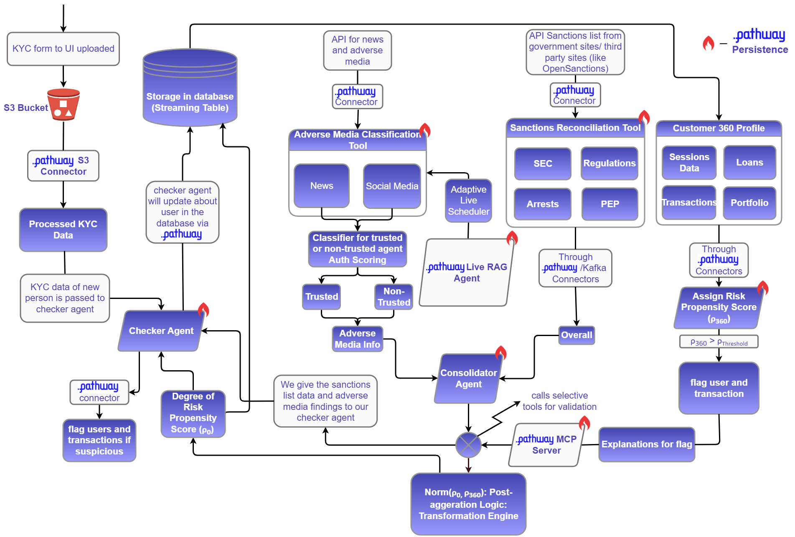

# FraudGuard

**A streaming KYC/AML compliance platform.** It ingests KYC forms, screens
applicants against sanctions lists and adverse media, scores transaction
behaviour in real time, and puts what it finds in front of a compliance officer —
recomputing every answer as new evidence arrives rather than overnight.

Built on [Pathway](https://pathway.com) for the streaming layer, FastAPI for the
API, and Next.js for the operator console. Submitted for Inter-IIT Tech Meet
14.0 (Pathway problem statement).

<p align="center">
  
</p>

---

## Contents

1. [What it does](#what-it-does)
2. [How it works](#how-it-works)
3. [Quick start](#quick-start)
4. [Repository layout](#repository-layout)
5. [The three services](#the-three-services)
6. [Running the system](#running-the-system)
7. [Risk scoring](#risk-scoring)
8. [The machine-learning model](#the-machine-learning-model)
9. [Configuration reference](#configuration-reference)
10. [API reference](#api-reference)
11. [Database](#database)
12. [Development](#development)
13. [Troubleshooting](#troubleshooting)
14. [Documentation index](#documentation-index)
15. [About this refactor](#about-this-refactor)

---

## What it does

| Capability | What happens |
| --- | --- |
| **KYC intake** | Watches an S3 prefix for uploaded PDF forms. Google Document AI extracts 25 structured fields; OpenCV crops any faces on the pages; the crops are reverse-searched to find the applicant's public presence, and those URLs become extra evidence. |
| **Sanctions screening** | Every applicant is screened against **OpenSanctions** (name, date of birth, nationality, alias) and **OFAC**. Results are cached and retried; a failure is recorded distinctly, so "no match found" never gets confused with "we could not check". |
| **Adverse-media research** | Searches for negative coverage of the applicant, fetches each article with two independent extractors, assesses the *source* (page structure, archive history, threat intelligence), and has an LLM rate each article's authenticity. |
| **Compliance verdict** | A weighted fusion of sanctions, web evidence and match confidence — computed by an LLM following a fixed algorithm **and** deterministically in Python, with the divergence between the two recorded on every record. |
| **Transaction monitoring** | Change data capture on the ledger drives a CatBoost classifier, an Isolation Forest and a 12-rule Bayesian engine, fused into a single risk propensity score with a written explanation. |
| **Agentic validation** | Verdicts above the escalation threshold go to a CrewAI agent that decides *which* external checks are warranted, calls them over MCP, and writes up whether they support or contradict the score. |
| **Continuous re-screening** | A watchdog re-checks every onboarded customer on an adaptive interval, and when public coverage of them changes it re-derives the score from the *delta* rather than from scratch. |
| **Operator console** | Dashboards, a user directory, the transaction ledger, an alert review queue, and superadmin views for audit logs, system metrics and health. |

---

## How it works

Three independent paths write to one database. Nothing is polled on a timer that
could have been event-driven.

### Path 1 — Onboarding: *who is this?*

```
  S3 bucket (KYC form, PDF)
        │
        │  ┌──────────────────────────────────────────────────────────┐
        └─▶│ kyc-ocr                                                  │
           │   · Document AI  → 25 structured fields, content-cached  │
           │   · face crops   → uploaded as the profile picture       │
           │   · reverse image search → public photo source pages     │
           │   · entity_id = hash(UIN, passport, name, DOB)           │
           └──────────────────────────────────────────────────────────┘
        │
        ▼  Kafka topic: entities
           ┌──────────────────────────────────────────────────────────┐
           │ kyc-enrichment                                           │
           │   · OpenSanctions screening (cached, retried)            │
           │   · adverse media: search → fetch → source reputation    │
           │                    → per-article LLM authenticity rating │
           │   · compliance LLM verdict                               │
           │   · deterministic verdict, computed in parallel          │
           │   · score_audit = divergence between the two             │
           └──────────────────────────────────────────────────────────┘
        │
        ▼  Kafka topic: db_updates
           ┌──────────────────────────────────────────────────────────┐
           │ db-sink   type coercion, hashing, date parsing           │
           └──────────────────────────────────────────────────────────┘
        │
        ▼  Staging_Buffer  ──AFTER INSERT trigger, one transaction──▶
                 Users · ToxicityHistory · UserSanctionMatches
```

Every stage also appends to an audit trail under `services/pipeline/out/`.

### Path 2 — Monitoring: *does this behaviour look wrong?*

```
  Transactions table
        │  write-ahead log
        ▼
  Debezium (pgoutput)
        │
        ▼  Kafka topic: postgres.public.transactions
           ┌──────────────────────────────────────────────────────────┐
           │ rps-features                                             │
           │   one parameterised SQL statement per affected user:     │
           │   6 aggregates × 4 windows (1h/24h/7d/30d) + in/out ratio│
           └──────────────────────────────────────────────────────────┘
        │
        ▼  Kafka topic: rps_processed_features
           ┌──────────────────────────────────────────────────────────┐
           │ rps-explain                                              │
           │   POST /score  → p_ml, anomaly, evidence, rps            │
           │   LLM interprets the numbers (never changes them)        │
           └──────────────────────────────────────────────────────────┘
        │
        ▼  Kafka topic: possible_fraud
           ┌──────────────────────────────────────────────────────────┐
           │ mcp-agent            (only when rps > 0.4)               │
           │   folds the score into the customer's standing risk      │
           │   agent decides which tools to call ──┐                  │
           └───────────────────────────────────────┼──────────────────┘
                                                   │  MCP over HTTP
                            ┌──────────────────────▼──────────────────┐
                            │ mcp-server                              │
                            │   ofac_call · pep_call · news_call      │
                            └─────────────────────────────────────────┘
        │
        ▼  compliance_alerts  ──▶  the review queue in the console
```

### Path 3 — Re-screening: *has anything changed since?*

```
  scheduler  (adaptive interval, 10 min ─ 2 h)
        │
        ▼
  watchdog   least-recently-checked customers first
        │      re-screens sanctions + adverse media
        │      compares against the previous snapshot, per entity
        │
        ├── coverage unchanged  ──▶  interval grows after 3 quiet sweeps
        │
        └── coverage changed    ──▶  rag-server
                                       indexes {old evidence, new evidence}
                                       re-derives the score from the delta
                                          │
                                          ▼
                                   Users.current_rps_not
                                   ToxicityHistory (audit row)
```

The interval halves on every sweep that finds a change, and grows by 20% after
three consecutive quiet sweeps — so a busy period is sampled densely without
burning search-API quota when nothing is happening.

---

## Quick start

### Prerequisites

| | Version | Notes |
| --- | --- | --- |
| Docker + Compose | v2 | Kafka, Postgres, Debezium, Redis |
| Python | 3.10+ | Pipeline and API |
| Node | 20+ | Console (`pnpm` recommended) |
| Disk | ~3 GB | Mostly the ML datasets and Docker images |

None of the third-party API keys are needed to get the stack *running* — each
one enables a specific feature, and `make doctor` tells you which are missing.

### 1. Configure

```bash
cp .env.example .env
$EDITOR .env
```

The minimum to start everything:

```bash
POSTGRES_PASSWORD=<anything>          # also used by docker compose
SECRET_KEY=$(openssl rand -hex 32)    # the API refuses placeholders in production
```

### 2. Bring up the infrastructure

```bash
make up
```

This starts the four containers, applies the six schema migrations in order,
creates the six Kafka topics with retention policies, and registers the Debezium
connector. It is idempotent — safe to re-run.

### 3. Install dependencies

```bash
make install                 # pipeline + API + console
# or, for OCR, the agent and face matching as well:
make install-pipeline-full
```

### 4. Check before starting anything

```bash
make doctor
```

```
FraudGuard environment check
============================================================
 ✓ configuration  env=development log_level=INFO out=.../services/pipeline/out
 ✓ packages       all optional integrations available
 ! credentials    set: POSTGRES_PASSWORD | missing: OS_API_KEY, MISTRAL_KEY | search key pairs: 0
 ✓ models         version 1ba06b8aa374, 25 features
 ✓ kafka          reachable at localhost:9092
 ✓ postgres       values_db @ localhost (PostgreSQL 16.1)
 ✓ schema         11 expected tables present
 ! scorer         http://127.0.0.1:9000/score not listening
 ✓ guardrails     toxicity and profanity validators loaded
============================================================
 6 passed, 2 warnings, 0 failures
```

It exits non-zero only on a real failure; warnings are features you have not
configured yet.

### 5. Run it

Three terminals for the core, more for the pipeline flows you want:

```bash
make scorer     # :9000   the RPS model
make api        # :8001   the compliance API  → http://localhost:8001/docs
make web        # :3000   the console         → http://localhost:3000
```

Sign in with `admin` / `admin123` — then
[change it](docs/OPERATIONS.md#security-checklist-before-exposing-anything).

### 6. See it working

```bash
make seed                                        # demo users, transactions, alerts
python tools/simulate.py users --count 20        # synthetic customers
python tools/simulate.py burst --user-id 1001    # a structuring pattern
```

`burst` deliberately writes eight sub-750 transfers followed by one large
transaction — enough to trip `high_velocity_1h` and
`structuring_small_then_large_24h`. With `rps-features`, `rps-explain` and
`mcp-agent` running, an alert appears in the console within seconds.

---

## Repository layout

```
Pathway-InterIIT-14/
│
├── services/
│   ├── pipeline/                 the streaming half — Pathway flows + the model
│   │   ├── fraudguard/           the package (8.2k LOC)
│   │   │   ├── config.py             one validated settings object
│   │   │   ├── logging.py            structured logs with bound context
│   │   │   ├── errors.py             the exception hierarchy
│   │   │   ├── schemas.py            Pathway schemas shared by every flow
│   │   │   ├── udfs.py               reusable UDFs, each wrapping a pure function
│   │   │   ├── scoring.py            the deterministic risk algorithm
│   │   │   ├── features.py           point-in-time transaction features (SQL)
│   │   │   ├── similarity.py         adverse-media change detection
│   │   │   ├── risk_updates.py       folding a score into standing risk
│   │   │   ├── doctor.py             environment diagnostics
│   │   │   ├── io/                   http · postgres · jsonl · state
│   │   │   ├── llm/                  client · guard · prompts
│   │   │   ├── enrichment/           opensanctions · ofac · search · articles
│   │   │   │                         · reputation · web_analysis
│   │   │   ├── rps/                  registry · engine · service · cli
│   │   │   ├── vision/               face matching · image search
│   │   │   ├── flows/                the nine runnable dataflows
│   │   │   └── scheduler/            the adaptive watchdog loop
│   │   ├── ml/                   ★ trained models + training code — UNTOUCHED
│   │   │   ├── models/               4 × .pkl, lr_dict, thresholds, train_*.py
│   │   │   ├── rules/                rule engine · evidence · prior · LRs
│   │   │   ├── features/ fusion/ preprocessing/
│   │   │   ├── data/processed/       the parquet files inference reads
│   │   │   ├── datasets/             raw training data (AMLSim, SML-D)
│   │   │   └── train_pipeline.sh     end-to-end retraining
│   │   ├── samples/              example payloads for manual testing
│   │   ├── tests/                99 unit tests
│   │   └── out/                  append-only audit trail (git-ignored)
│   │
│   ├── api/                      FastAPI compliance API (7.3k LOC)
│   │   ├── app/
│   │   │   ├── main.py               application factory + lifespan
│   │   │   ├── db.py                 lazy engine, request-scoped sessions
│   │   │   ├── core/                 config · logging · security · errors
│   │   │   │                         · middleware · pagination · cache
│   │   │   ├── models/               SQLAlchemy tables
│   │   │   ├── schemas/              Pydantic request/response models
│   │   │   ├── routes/               HTTP endpoints
│   │   │   └── services/             business logic
│   │   ├── scripts/              seeding, migrations, inspection
│   │   ├── tests/                unit · integration · load
│   │   └── docs/                 endpoint references
│   │
│   └── web/                      Next.js 16 operator console (10.7k LOC)
│       └── src/
│           ├── app/                  routes (App Router)
│           ├── components/           shared components; ui/ is shadcn
│           ├── hooks/                data hooks, one module per domain
│           └── lib/
│               ├── api/              the API client, split by domain
│               ├── format.ts         currency · dates · risk bands
│               └── transformers.ts   API shapes → component shapes
│
├── infra/
│   ├── docker-compose.yml        Kafka · Postgres · Debezium · Redis
│   ├── bootstrap.sh              one command to stand everything up
│   ├── postgres/migrations/      6 versioned, idempotent SQL files
│   ├── postgres/seed/            optional demo fixtures
│   ├── kafka/create-topics.sh    topics with retention policies
│   └── debezium/                 CDC connector definition + registration
│
├── tools/simulate.py             synthetic traffic generator
├── docs/                         architecture · operations · database
│                                 · refactor notes · roadmap
├── assets/                       diagram · report · videos
├── Makefile                      every task, documented by `make help`
└── .env.example                  every setting, annotated
```

---

## The three services

### `services/pipeline` — the streaming half

Nine Pathway dataflows plus the model-serving HTTP service, all behind one entry
point:

```bash
python -m fraudguard --list
python -m fraudguard kyc-enrichment
python -m fraudguard doctor
```

Four rules the package follows throughout:

1. **Nothing happens at import time.** No `pw.run()`, no API clients, no
   database connections, no `os.environ[...]` at module scope. Importing any
   module is free — which is what makes the flows testable and the CLI fast.
2. **Every UDF wraps a pure function.** `_extract_json_and_summary` is plain
   Python and unit-tested; `extract_json_and_summary` is the Pathway wrapper.
3. **Optional dependencies degrade, they do not crash.** Guardrails, OTX,
   scikit-learn, DeepFace, FAISS and the two article extractors are all
   optional; `doctor` reports exactly which features are unavailable.
4. **The deterministic score is always computed**, so a decision is always
   explainable even when the LLM is unreachable.

→ [`services/pipeline/README.md`](services/pipeline/README.md)

### `services/api` — the compliance API

FastAPI over the same Postgres the pipeline writes — 69 operations across 63
paths, covering users, transactions, compliance alerts, dashboards, exports,
auth and superadmin monitoring.

Conventions that apply everywhere:

* **One error shape.** Validation, business, database and unhandled errors all
  return `{"error": {"code", "message", "details"}, "request_id"}`.
* **Correlation.** Every response carries `X-Request-ID` and
  `X-Response-Time-ms`; send your own id and it is echoed back and stamped on
  every log line for that request.
* **Pagination.** List endpoints take `offset`/`limit` and return
  `{items, total, offset, limit, has_more}`.
* **Real health probes.** `/health/live` and `/health/ready`, the latter naming
  the dependency that failed.

→ [`services/api/README.md`](services/api/README.md)

### `services/web` — the operator console

Next.js 16 (App Router), React 19, Tailwind 4, shadcn/ui.

`@/lib/api` and `@/hooks/useApi` are barrels over per-domain modules, so imports
read the same as before while the implementations stay small. The fetch client
handles auth, timeouts, aborts, retries, both API error shapes, and automatic
sign-out on 401.

→ [`services/web/README.md`](services/web/README.md)

---

## Running the system

### Every flow

| Command | Reads | Writes | Requires |
| --- | --- | --- | --- |
| `kyc-ocr` | S3 `forms/pending/` | `entities` topic | AWS + Document AI |
| `kyc-enrichment` | `entities` | `db_updates` topic | `OS_API_KEY`, `MISTRAL_KEY` |
| `db-sink` | `db_updates` | `Staging_Buffer` | `POSTGRES_PASSWORD` |
| `rps-features` | Debezium CDC | `rps_processed_features` | `POSTGRES_PASSWORD` |
| `rps-explain` | `rps_processed_features` | `possible_fraud` | the scorer |
| `mcp-server` | — | MCP on :8123 | `PW_LICENSE` |
| `mcp-agent` | `possible_fraud` | `compliance_alerts` | `GEMINI_API_KEY`, mcp-server |
| `rag-server` | watchdog corpus | HTTP on :8000 | `MISTRAL_KEY` |
| `watchdog` | `Users` | `out/watchdog_report.jsonl` | `POSTGRES_PASSWORD`, `OS_API_KEY` |
| `scheduler` | — | Postgres + RAG | the rag-server |
| `scorer` | — | HTTP on :9000 | `ml/models` artefacts |
| `doctor` | — | stdout | nothing |

Each flow is a separate process. Stopping one stops that stage only; the others
keep running and the Kafka topic buffers the backlog until it returns.

### Recommended start-up order

```bash
# 1. models — start first so rps-explain finds the scorer
python -m fraudguard scorer

# 2. the KYC path
python -m fraudguard kyc-enrichment
python -m fraudguard db-sink
python -m fraudguard kyc-ocr          # only with AWS + Document AI credentials

# 3. the transaction path
python -m fraudguard rps-features
python -m fraudguard rps-explain
python -m fraudguard mcp-server
python -m fraudguard mcp-agent

# 4. continuous re-screening
python -m fraudguard rag-server
python -m fraudguard scheduler
```

### Ports

| Port | Service | Started by |
| --- | --- | --- |
| 3000 | Web console | `make web` |
| 8001 | Compliance API | `make api` |
| 9000 | RPS scorer | `make scorer` |
| 8000 | RAG server | `fraudguard rag-server` |
| 8123 | MCP tool server | `fraudguard mcp-server` |
| 9092 | Kafka | `make up` |
| 5432 | PostgreSQL | `make up` |
| 8083 | Debezium Connect | `make up` |
| 6379 | Redis (optional) | `make up` |

### Kafka topics

| Topic | Retention | Producer → Consumer |
| --- | --- | --- |
| `entities` | 7 days | `kyc-ocr` → `kyc-enrichment` |
| `db_updates` | 7 days | `kyc-enrichment` → `db-sink` |
| `postgres.public.transactions` | 1 day | Debezium → `rps-features` |
| `rps_processed_features` | 1 day | `rps-features` → `rps-explain` |
| `possible_fraud` | 7 days | `rps-explain` → `mcp-agent` |
| `postgres.public.toxicityhistory` | 1 day | Debezium → (reserved) |

Auto-topic-creation is disabled on the broker, so a typo in a topic name fails
loudly instead of silently creating an empty topic nobody reads. Each flow gets
its own consumer group (`$GROUP_ID-$FLOW`).

---

## Risk scoring

Two scores are kept per customer and deliberately **not** conflated:

| Column | Source | Meaning |
| --- | --- | --- |
| `current_rps_not` | KYC, sanctions, adverse media | Standing, identity-derived risk |
| `current_rps_360` | Transaction behaviour | Latest behavioural risk |

They are combined only when a transaction verdict is applied:

```
if standing ≤ 0.2:   new = incoming                        # replace
else:                new = 1 − (1 − standing)(1 − incoming) # probabilistic union
```

The floor exists so a near-clean profile is not dragged upward by the union of
two small numbers.

### The compliance score (identity side)

```
sanction_score      = min(N / 5, 1)                  N = confirmed sanctions matches
web_evidence_score  = 1 − Π(1 − authenticityᵢ × severityᵢ)
match_confidence    = the OpenSanctions match score, in [0, 1]

risk_score = 0.60·sanction_score
           + 0.30·web_evidence_score
           + 0.10·match_confidence
```

Article severity, taken from the declared type or inferred from the headline
and excerpt when none is given:

| Type | Severity | Type | Severity |
| --- | :-: | --- | :-: |
| `official_sanction` | 1.00 | `credible_allegation` | 0.60 |
| `conviction` | 0.95 | `negative_media` | 0.30 |
| `indictment` / `charges` | 0.85 | `other` | 0.20 |
| `regulatory_fine` | 0.70 | `rumour` | 0.10 |

Bands: `LOW < 0.25 ≤ MEDIUM < 0.50 ≤ HIGH < 0.75 ≤ CRITICAL`.

This is computed **twice** — once by the LLM following the prompt, once
deterministically in `fraudguard/scoring.py`. The LLM's answer is used; the
divergence is written to `score_audit`, and anything outside ±0.15 is logged as
a warning. When the LLM is unavailable the deterministic answer is used and
marked `verdict_source: "deterministic"`.

That is what makes a decision defensible: the arithmetic is in the repository,
not only in a prompt.

### The transaction score (behavioural side)

Four signals fused by logistic regression:

| Signal | Model | Input |
| --- | --- | --- |
| `p_ml` | CatBoost classifier | the 25 windowed aggregates |
| `anomaly` | Isolation Forest (500 trees, contamination 0.01), min-max scaled | the same vector |
| `evidence` | Bayesian posterior | 12 rule hits × per-rule likelihood ratios × the fraud prior |
| `rps` | Logistic regression | `logit(p_ml)`, `logit(anomaly)`, `evidence` |

The prior is computed at start-up from `ml/data/processed/features.parquet`, so
the evidence term reflects the base rate the model was trained against rather
than a hard-coded constant.

Bands here are much tighter than the KYC bands — the fusion output is heavily
skewed towards zero for legitimate accounts: `LOW < 0.15 ≤ MEDIUM < 0.30 ≤ HIGH`.
The agent escalates above `rps > 0.4`.

#### The 12 rules

| Rule | Fires when |
| --- | --- |
| `high_velocity_1h` | ≥ 5 transactions in an hour |
| `large_txn_1h` | a single transaction ≥ 3,000 in an hour |
| `high_unique_cp_1h` | ≥ 3 distinct counterparties in an hour |
| `structuring_small_then_large_24h` | ≥ 6 transactions, average < 800, **and** a maximum > 5,000 |
| `high_volume_24h` | ≥ 20,000 total in a day |
| `rapid_counterparty_increase_24h` | ≥ 5 distinct counterparties in a day |
| `high_velocity_7d` | ≥ 25 transactions in a week |
| `high_volume_7d` | ≥ 50,000 total in a week |
| `cp_spike_7d` | ≥ 10 distinct counterparties in a week |
| `incoming_outgoing_anomaly` | 7-day incoming/outgoing ratio ≥ 3, or exactly 0 |
| `rapid_growth_between_windows` | an hour holds ≥ 50% of the week's transactions |
| `unusual_average_amount` | the week's maximum is ≥ 10× its average |

Rule hits are returned on request — `POST /score` with `"explain": true` — so an
operator can see exactly which patterns triggered a score.

---

## The machine-learning model

`services/pipeline/ml/` holds the trained artefacts and the code that produced
them, **unchanged by the refactor**. Every file still carries its original
timestamp.

```
ml/
├── models/
│   ├── p_ml_model.pkl            CatBoost classifier         (1.2 MB)
│   ├── anomaly_model.pkl         Isolation Forest            (3.5 MB)
│   ├── anomaly_scaler.pkl        min-max scaler for the decision function
│   ├── fusion_model.pkl          logistic regression over the three signals
│   ├── lr_dict.json              per-rule likelihood ratios
│   ├── training_features.json    the 25 feature names, in training order
│   ├── p_ml_thresholds.json      best_f1 0.721 · precision_95 0.721 · recall_80 0.465
│   └── train_supervised.py · train_supervised_ensembled.py · train_anomaly.py
├── rules/                        rule engine · evidence · prior · likelihood ratios
├── features/generate_features.py
├── fusion/fusion_model.py · score_rps.py
├── preprocessing/load_datasets.py
├── data/processed/*.parquet      what inference reads (features.parquet → prior)
├── datasets/                     AMLSim + SML-D, plus a synthetic KYC set
└── train_pipeline.sh             the 7-step end-to-end retraining script
```

**Serving adapts to training, not the other way round.**
`fraudguard/rps/engine.py` puts `ml/` on `sys.path` and imports
`rules.rule_engine`, `rules.evidence` and `rules.compute_prior` exactly as
`train_pipeline.sh` does — so a threshold changed in the rule engine takes effect
in both places, and the two cannot drift apart.

### Provenance

Every artefact is SHA-256'd at start-up. The digest of the set is the model
version, and it is attached to every score:

```bash
curl localhost:9000/model | jq '{model_version, feature_count, missing}'
```

```json
{ "model_version": "1ba06b8aa374", "feature_count": 25, "missing": [] }
```

A regulator asking "which model produced this decision?" gets an answer, and a
deployment that swaps a `.pkl` without telling anyone shows up as a changed
digest in the logs.

### Retraining

```bash
cd services/pipeline/ml && bash train_pipeline.sh
```

Seven steps: load and normalise the datasets → generate rolling features → train
the supervised model → train the anomaly model → compute the prior, rule hits,
likelihood ratios and evidence → train the fusion layer → export the feature
list.

### Scoring by hand

```bash
curl -s -X POST http://127.0.0.1:9000/score \
  -H 'Content-Type: application/json' \
  -d @services/pipeline/samples/score_request.json | jq
```

The response:

| Field | Type | Meaning |
| --- | --- | --- |
| `p_ml` | float | Supervised probability of fraud |
| `anomaly` | float | Scaled Isolation Forest decision function |
| `evidence` | float | Bayesian posterior from the rule hits |
| `rps` | float | The fused risk propensity score |
| `risk_band` | string | `LOW` / `MEDIUM` / `HIGH` |
| `model_version` | string | Digest of the artefact set that produced this score |
| `fired_rules` | string[] | Which rules matched — only with `"explain": true` |
| `rule_hits` | object | Every rule and whether it fired — only with `"explain": true` |
| `missing_features` | string[] | Features the caller omitted, imputed as 0 |

Other endpoints: `POST /score/batch` (up to 500 vectors), `GET /features` (the
contract the model expects), `GET /healthz`.

---

## Configuration reference

Everything is read from one `.env` at the repository root. Each service also
reads its own directory, so per-service overrides work.
[`.env.example`](.env.example) documents every setting inline.

A missing key never breaks an unrelated flow — it stops exactly the feature that
needs it, and `make doctor` says which.

### Required to run anything

| Variable | Default | Used by |
| --- | --- | --- |
| `POSTGRES_PASSWORD` | — | compose, API, `db-sink`, `rps-features`, `mcp-agent`, `watchdog` |
| `SECRET_KEY` | generated in dev | API — **required in production** |

### Database

| Variable | Default |
| --- | --- |
| `POSTGRES_HOST` / `POSTGRES_PORT` | `localhost` / `5432` |
| `POSTGRES_DB` / `POSTGRES_DBNAME` | `values_db` (either name works) |
| `POSTGRES_USER` | `user` |
| `POSTGRES_POOL_SIZE` | `10` |
| `DATABASE_URL` | assembled from the parts above |

### Kafka

| Variable | Default |
| --- | --- |
| `BOOTSTRAP_SERVERS` | `localhost:9092` |
| `GROUP_ID` | `fraudguard` — each flow appends its own suffix |
| `AUTO_OFFSET_RESET` | `earliest` |
| `KAFKA_AUTOCOMMIT_MS` | `100` |
| `MAIN_BACKEND_TOPIC`, `DB_TOPIC`, `RPS_FEATURES_TOPIC`, `FRAUD_TOPIC`, `TRANSACTIONS_CDC_TOPIC` | see the table above |

### Compliance data sources

| Variable | Enables |
| --- | --- |
| `OS_API_KEY` | OpenSanctions screening |
| `SANCTIONS_API_KEY` | OFAC screening (`ofac_call` MCP tool) |
| `OTX_API_KEY` | AlienVault source reputation |
| `GOOGLE_CLOUD_API_KEY_n` + `PROGRAMMABLE_SEARCH_ENGINE_ID_n` | Adverse-media search — key *n* is always paired with engine *n*; add as many numbered pairs as you have quota for |
| `ADVERSE_KEYWORDS` | `fraud,scam` — each is searched alongside the subject name |
| `SEARCH_RESULTS_PER_QUERY` | `2` |
| `HTTP_TIMEOUT_S` / `HTTP_RETRIES` | `30` / `3` |

### LLM

| Variable | Default | Notes |
| --- | --- | --- |
| `MISTRAL_KEY` | — | every LLM-backed flow |
| `LLM_MODEL` | `mistral/mistral-small-latest` | any LiteLLM model id |
| `EMBEDDING_MODEL` / `EMBEDDING_API_KEY` | `mistral/mistral-embed` / falls back to `MISTRAL_KEY` | the RAG server |
| `CROSS_ENCODER_MODEL` | — | optional RAG reranker |
| `GEMINI_API_KEY` / `AGENT_MODEL` | — / `gemini-2.5-flash` | the validation agent |
| `GUARDRAILS_ENABLED` | `true` | `false` skips content validation entirely |
| `GUARDRAILS_TOXICITY_THRESHOLD` | `0.5` | |
| `LLM_MAX_RETRIES` / `LLM_TIMEOUT_S` | `4` / `60` | |

### Pipeline runtime

| Variable | Default | Notes |
| --- | --- | --- |
| `PW_LICENSE` | — | required only by the MCP server |
| `PATHWAY_MCP_URL` | `http://localhost:8123/mcp/` | |
| `SCORE_URL` | `http://127.0.0.1:9000/score` | |
| `RAG_URL` | `http://127.0.0.1:8000/v2/answer` | |
| `LOG_LEVEL` / `LOG_JSON` | `INFO` / `false` | `true` emits NDJSON for a log shipper |
| `RPS_LEGACY_LOGIT` | `false` | reproduce scores from before the `logit()` fix |

### KYC intake (optional)

`AWS_REGION`, `AWS_ACCESS_KEY_ID`, `AWS_SECRET_ACCESS_KEY`, `AWS_BUCKET_NAME`,
`AWS_FORMS_PREFIX`, `AWS_PROFILEPIC_BUCKET`, `PROCESSOR_NAME`,
`GOOGLE_APPLICATION_CREDENTIALS`.

### API

| Variable | Default | Notes |
| --- | --- | --- |
| `APP_ENV` | `development` | `production` enables strict validation |
| `CORS_ORIGINS` | `http://localhost:3000` | JSON array or comma-separated; `*` refused in production |
| `ACCESS_TOKEN_EXPIRE_MINUTES` | `480` | |
| `REFRESH_TOKEN_EXPIRE_DAYS` | `7` | |
| `BCRYPT_ROUNDS` | `12` | |
| `RATE_LIMIT_PER_MINUTE` | `300` | per client, per worker; `0` disables |
| `DEFAULT_PAGE_SIZE` / `MAX_PAGE_SIZE` | `50` / `500` | |
| `TRUST_PROXY_HEADERS` | `false` | only enable behind a proxy you control |
| `REDIS_ENABLED` | `false` | optional dashboard cache |
| `AUTO_CREATE_TABLES` | `false` | ORM-created schema, local throwaway DBs only |

### Console

`NEXT_PUBLIC_API_BASE_URL` (default `http://127.0.0.1:8001`),
`NEXT_PUBLIC_API_TIMEOUT_MS`. Copy
`services/web/.env.example` → `services/web/.env.local`.

---

## API reference

Base URL `http://localhost:8001`. Interactive docs at `/docs` (Swagger) and
`/redoc`.

### Conventions

**Errors** — every failure, from any layer:

```json
{
  "error": { "code": "not_found", "message": "User 42 was not found", "details": {} },
  "request_id": "9f2c1ab4e7d0"
}
```

Codes: `validation_failed`, `unauthenticated`, `forbidden`, `not_found`,
`conflict`, `rate_limited`, `database_unavailable`, `upstream_unavailable`,
`internal_error`.

**Pagination** — `?offset=0&limit=50` (`skip` is a deprecated alias):

```json
{ "items": [ ... ], "total": 1043, "offset": 0, "limit": 50, "has_more": true }
```

**Auth** — `POST /api/auth/login` takes an OAuth2 password form and returns a
bearer token. Tokens carry a `typ` claim, so a refresh token cannot be replayed
as an access token.

```bash
TOKEN=$(curl -s -X POST localhost:8001/api/auth/login \
  -d 'username=admin&password=admin123' | jq -r .access_token)
curl -s localhost:8001/api/auth/me -H "Authorization: Bearer $TOKEN" | jq
```

### Endpoints

The **Auth** column states what the code enforces today, not what it should.
See the warning below the table.

| Group | Endpoints | Auth enforced |
| --- | --- | --- |
| **Health** | `GET /health` · `/health/live` · `/health/ready` · `/version` | none — by design |
| **Auth** | `POST /api/auth/login` | none — by design |
| | `POST /api/auth/logout` · `GET /api/auth/me` | token |
| | `GET /api/auth/superadmin/logs` · `/admins` · `POST /superadmin/create-admin` | `superadmin` |
| **Users** | `GET /users` · `/users/{id}` · `/user/all` · `/user/{id}` · `/user/risk/{category}` · `/user/blacklisted/all` | ⚠️ none |
| | `POST /user/add` | ⚠️ none |
| | `PATCH` · `DELETE /user/{id}` · `POST /user/{id}/blacklist` · `/whitelist` · `/user/upload-form` | `admin` |
| **Transactions** | every endpoint — reads, `POST /add`, `PATCH`, `DELETE` | ⚠️ none |
| **Compliance** | `GET /compliance/alerts` · `/alerts/top` · `/alerts/{id}` · `/alerts/stats/summary` · `POST /compliance/alerts` | ⚠️ none |
| | `PATCH /alerts/{id}` · `POST /alerts/{id}/acknowledge` · `/resolve` · `/dismiss` | `admin` |
| **Dashboard** | `GET /dashboard/summary` · `/risk-distribution` · `/flagged-transactions` · `/critical-alerts` · `/live-alerts` · `/alert-trend` · `/alerts/unclassified` | ⚠️ none |
| | `POST /dashboard/alerts/{id}/dismiss` | `admin` |
| **Export** | `POST /export/users` · `/export/transactions` | ⚠️ none |
| **Superadmin** | `GET /api/superadmin/dashboard` · `/audit-logs` · `/metrics/*` · `/health/checks` · `/alerts` · `/system-status` and their `PATCH`/`POST` counterparts | `superadmin` |

> **⚠️ Known gap: most endpoints are unauthenticated**
>
> Auditing every route showed that **38 of 69 operations declare no authentication
> dependency at all**. Five of those are public by design — `POST /api/auth/login`,
> the three health probes and `/version` — which leaves **33 that should not be**.
> Only 10 mutations wired to `require_admin`, 2 wired to a plain token check, and
> the 19-operation superadmin router are protected.
>
> The consequences worth naming:
>
> * `POST /export/users` and `POST /export/transactions` return bulk customer PII
>   to any caller — the most serious of the three.
> * `POST /user/add`, `POST /transactions/add`, `PATCH` and
>   `DELETE /transactions/{id}` allow unauthenticated writes to the ledger and the
>   customer table.
> * Every dashboard aggregate and the full user directory are readable anonymously.
>
> This is pre-existing behaviour, not something the refactor introduced, and it is
> **not** fixed here: closing it means adding a dependency to 33 routes, and that
> change cannot be verified without a running stack and console. The console
> already attaches its bearer token to every request, so the fix is expected to be
> transparent — but "expected to be" is not "verified", and silently changing the
> security posture of 33 endpoints is worse than documenting the gap.
>
> **Do not expose this API to an untrusted network until it is closed.** Tracked
> as P0.4 in [`docs/ROADMAP.md`](docs/ROADMAP.md); the audit that produced these
> numbers is reproducible with the snippet in
> [`docs/OPERATIONS.md`](docs/OPERATIONS.md#auditing-endpoint-authentication).

Full request/response reference:
[`services/api/docs/FRONTEND_API_REFERENCE.md`](services/api/docs/FRONTEND_API_REFERENCE.md)
and [`SUPERADMIN_API_DOCS.md`](services/api/docs/SUPERADMIN_API_DOCS.md).

### The scoring service (port 9000)

| Endpoint | Purpose |
| --- | --- |
| `POST /score` | Score one feature vector; `"explain": true` adds rule hits and provenance |
| `POST /score/batch` | Up to 500 vectors |
| `GET /healthz` | Readiness — 503 with a reason when the models cannot load |
| `GET /model` | Artefact digests, model version, thresholds |
| `GET /features` | The 25 feature names the model expects |

---

## Database

PostgreSQL 16 is the system of record. The schema lives in
`infra/postgres/migrations/` as six numbered, idempotent files applied in order.

| Table | Purpose |
| --- | --- |
| `Users` | The customer record, both risk scores, KYC status, blacklist state |
| `Transactions` | The ledger; Debezium streams its write-ahead log |
| `ToxicityHistory` | Append-only audit of every score change, with its trigger |
| `UserSanctionMatches` | One row per screening that actually ran |
| `Staging_Buffer` | The pipeline's landing table; a trigger fans each row out |
| `compliance_alerts` | The review queue, including the true/false-positive outcome |
| `admins` · `audit_logs` | Accounts and every administrative action |
| `system_metrics` · `system_health` · `system_alerts` | Superadmin monitoring |

**Views** — `v_user_risk_overview`, `v_audit_logs_with_admin`,
`v_active_system_issues`, `v_metrics_last_24h`.

**Functions** — `calculate_alert_hit_rate`, `get_system_health_status`,
`archive_old_audit_logs`, `cleanup_old_health_checks`, `cleanup_staging_buffer`.

Two design points worth knowing:

* **Why a landing table and a trigger?** `pw.io.postgres.write` targets one
  table. Writing three tables from the stream would be three non-transactional
  writes that could partially fail; the trigger fans out inside one transaction.
* **Why CDC instead of the pipeline owning the ledger?** Transactions arrive from
  whatever system already owns them. Reading the WAL keeps the pipeline out of
  the write path entirely, and it cannot lose an event by being down.

→ [`docs/DATABASE.md`](docs/DATABASE.md) for the full schema, and
[`docs/USEFUL_QUERIES.sql`](docs/USEFUL_QUERIES.sql) for ad-hoc queries.

---

## Development

```bash
make help        # every target, with descriptions
make test        # 116 unit tests — no network, no Kafka, no Postgres
make lint        # ruff (pipeline, api) + eslint (console)
make typecheck   # tsc --noEmit
make check       # lint + test
make clean       # caches and regenerable outputs
```

### Testing

| Suite | Covers | Needs |
| --- | --- | --- |
| `services/pipeline/tests` (99) | the scoring contract, similarity, configuration parsing, JSONL and state stores, search key rotation | nothing |
| `services/api/tests/unit` (17) | configuration validation, pagination, rate limiting, the error envelope | nothing |
| `services/api/tests/integration` | endpoint behaviour | a live database and API |
| `services/api/tests/load` | throughput, via Locust | a running stack |

The unit suites deliberately need nothing running — they cover the places where a
regression would quietly change a compliance decision. `tests/test_scoring.py`
in particular pins the exact arithmetic the LLM prompt describes, so a prompt
edit that changes the algorithm without changing the code (or the reverse) fails
the build.

### Adding a flow

1. Create `fraudguard/flows/<name>.py` with a `build(context)` that declares the
   Pathway graph, then `main = flow_main("<name>", build, persistent=True)`.
2. Register it in the `COMMANDS` tuple in `fraudguard/__main__.py`.
3. Add its topic to `infra/kafka/create-topics.sh` if it needs one.

`build()` receives a `FlowContext` with the settings, a flow-scoped rdkafka
config, `context.out("file.jsonl")` and `context.require("KEY", ...)`. The run
loop, signal handling, persistence and error reporting are handled for you.

### Adding an endpoint

Route in `app/routes/`, business logic in `app/services/`, request/response
models in `app/schemas/`. Use the `page_params` dependency for lists and raise
`NotFoundError` / `ConflictError` / `AuthorizationError` from `app.core.errors`
rather than building an `HTTPException` — the handlers render the envelope.

**Route ordering matters**: declare literal paths (`/alerts/top`) before dynamic
ones (`/alerts/{alert_id}`), or FastAPI will match the dynamic route first.

### Changing the schema

Add a new numbered file in `infra/postgres/migrations/` — never edit an applied
one — make it idempotent, then update the SQLAlchemy model and, if the stream
writes the column, `fraudguard/schemas.py`. `make up` applies it.

---

## Troubleshooting

**A flow exits immediately with a configuration error.**
`make doctor`. It lists every missing key at once rather than dying on the first.

**`kyc-enrichment` runs but nothing reaches the database.**
Check `db-sink` is running, and that the topic has messages:

```bash
docker exec broker kafka-console-consumer --topic db_updates \
  --bootstrap-server broker:29092 --from-beginning --max-messages 1
```

**Nothing flows after inserting a transaction.**
Debezium is probably not capturing:

```bash
curl -s localhost:8083/connectors/fraudguard-postgres/status | jq
docker exec db_tuto_postgres psql -U user -d values_db \
  -c "SELECT slot_name, active FROM pg_replication_slots;"
```

**Every score is zero.**
`curl localhost:9000/healthz` reports whether the artefacts loaded. If the
feature vector itself is all zeros, `rps-features` could not reach Postgres —
it logs `Feature query failed` in that case.

**The LLM verdict disagrees badly with the deterministic score.**

```bash
jq 'select(.score_audit.within_tolerance == false)' \
  services/pipeline/out/llm_debug.jsonl
```

**Adverse-media search returns nothing.**
Google quota. The pool cools an exhausted key for 15 minutes and rotates; with
one pair configured, everything waits. Add more numbered pairs.

**The console shows "server unavailable" but the API responds.**
It probes `/health/live`, which fails when the API cannot reach the database.
`curl localhost:8001/health/ready` names the failing check.

**A flow will not resume after a crash.**
Pathway persistence lives in `services/pipeline/state/<flow>/`. Deleting that
directory forces a replay from the start of the topic.

→ [`docs/OPERATIONS.md`](docs/OPERATIONS.md) for the full runbook, including the
audit-trail layout and the pre-deployment security checklist.

---

## Documentation index

| Document | Contents |
| --- | --- |
| [Architecture](docs/ARCHITECTURE.md) | How the pieces fit, the three paths, scoring, design decisions, failure behaviour |
| [Operations](docs/OPERATIONS.md) | Start-up, health checks, logs, the audit trail, troubleshooting, security checklist |
| [Database](docs/DATABASE.md) | Every table, view and function; CDC; how to change the schema |
| [Refactor notes](docs/REFACTOR_NOTES.md) | What changed, what was deleted, ~40 bugs found and fixed, and what was *not* done |
| [Roadmap](docs/ROADMAP.md) | Remaining production-readiness work (Vault, DVC, ELK, Alembic) with current status |
| [Pipeline](services/pipeline/README.md) · [API](services/api/README.md) · [Console](services/web/README.md) | Per-service setup and design |
| [API reference](services/api/docs/FRONTEND_API_REFERENCE.md) · [Superadmin](services/api/docs/SUPERADMIN_API_DOCS.md) · [Uploads](services/api/docs/UPLOAD_FORM_API.md) | Endpoint-level detail |
| [Report](assets/End_Term_Report.pdf) · [Explainer](assets/Explain_Video.mp4) · [Summary](assets/Summary_Video.mp4) | Original submission material |

---

## About this refactor

This repository was restructured end to end from three zip archives, two of
which held near-duplicate copies of the same pipeline that had drifted apart —
twelve modules existed twice with different contents.

**The trained model, its training code and its artefacts were left byte-for-byte
unchanged.** Everything around them was rebuilt: one package instead of nine
loose scripts, one settings object instead of scattered `os.environ` reads, one
error shape instead of three, versioned migrations instead of a 700-line shell
script, and 116 unit tests where there were none.

Roughly 40 behavioural bugs were found and fixed along the way. The ones that
mattered most:

* `logit()` divided by `(1 - eps)` instead of `(1 - x)` — both fusion inputs were
  wrong for every score ever computed.
* Transaction feature windows were not partitioned by user, and `unique_cp_*` was
  an arbitrary counterparty *id* rather than a count.
* Debezium's `table.include.list` used mixed-case table names, which Postgres
  folds to lower case — so change capture never started.
* Every alert insert violated a CHECK constraint on `severity`.
* The admin seed could never execute, so there was no way to log in.
* `SECRET_KEY` fell back to a placeholder committed in the repository.
* The console logged full API responses — including customer PII — to the
  browser console in production.

One further defect was **found but deliberately not fixed**: 33 API endpoints
that should require authentication do not, including both bulk export endpoints.
Closing it changes the behaviour of 33 routes and cannot be verified without a
running stack, so it is documented in full
[under API reference](#endpoints) and tracked as P0.4
rather than changed blind.

[`docs/REFACTOR_NOTES.md`](docs/REFACTOR_NOTES.md) has the complete list, with a
closing section stating plainly what was deliberately *not* done.

---

<p align="center">
  Built for <b>Inter-IIT Tech Meet 14.0</b> · Pathway problem statement
</p>
